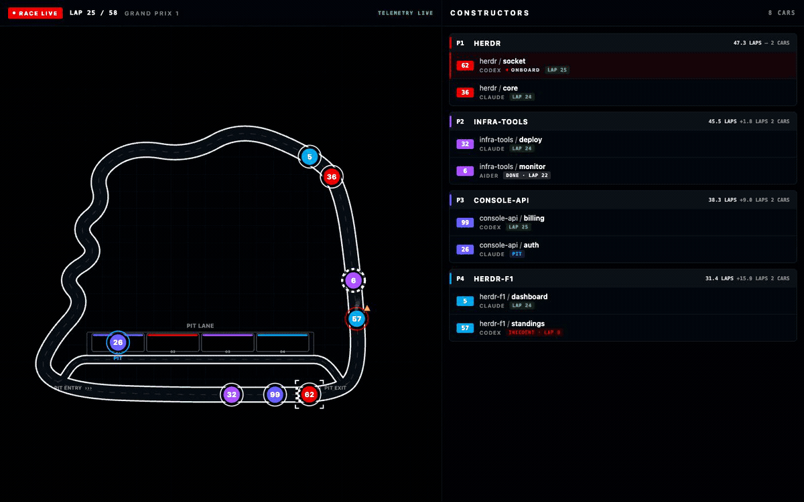

# Herdr F1

**An F1-style dashboard for your Herdr agents.**

[한국어](README.KR.md)

Herdr F1 visualizes the status of your running Herdr agents as an F1 race.



Each `workspace` becomes a team, and each `agent terminal` becomes a race car. Agents
race around the circuit while working, wait in the pits while idle, and stop on the
track when blocked. Select a car or a row in the standings to jump directly to its
Herdr terminal.

Laps, standings, and points are fictional data created for spectating. They do not
measure productivity or agent performance.

## Quick start

Requirements:

- macOS or Linux
- A running [Herdr](https://github.com/ogulcancelik/herdr) 0.7.4 or later
- Node.js 20 or later

Install the Herdr F1 plugin:

```sh
herdr plugin install hmu332233/herdr-f1
```

Open Herdr F1:

```sh
herdr plugin action invoke dev.minung.herdr-f1.open
```

Your browser will open, and agents in the current Herdr session will join the race.
To stop the dashboard, run:

```sh
herdr plugin action invoke dev.minung.herdr-f1.stop
```

The plugin includes the server and web assets required to run, so no separate
installation or build is needed.

### Open with a keyboard shortcut

Add the following to `~/.config/herdr/config.toml` to open the dashboard with
`prefix+f`. The default prefix is `ctrl+b`.

```toml
[[keys.command]]
key = "prefix+f"
type = "plugin_action"
command = "dev.minung.herdr-f1.open"
description = "open F1 dashboard"
```

Apply the updated configuration to the running Herdr session:

```sh
herdr server reload-config
```

## CLI

You can also run the dashboard from the CLI without installing the Herdr plugin. A
Herdr session must still be running.

```sh
npx herdr-f1 --open
```

Omit `--open` to print the local URL without opening a browser.

```sh
npx herdr-f1 [start] [--port <port>] [--open] [--socket <path>]
npx herdr-f1 status [--socket <path>]
npx herdr-f1 stop [--socket <path>]
```

If installed globally, you can omit `npx`. The default port is `4158`; if it is
already in use, Herdr F1 automatically finds the next available port.

## How it works

| Herdr status | Dashboard |
| --- | --- |
| `working` | Racing on the circuit |
| `idle` | Waiting in the pits |
| `done` | Finished racing |
| `blocked` | Stopped after an incident |

The dashboard reads Herdr session status and only sends a terminal-focus command
when you select a car. It does not collect terminal output or conversation content,
and the server binds only to `127.0.0.1` to prevent external access.

## Troubleshooting

If the plugin does not open, check its installation status and recent logs:

```sh
herdr plugin list --plugin dev.minung.herdr-f1
herdr plugin log list --plugin dev.minung.herdr-f1 --limit 20
```

To check the status and URL of a dashboard started from the CLI, run:

```sh
npx herdr-f1 status
```

## Development

```sh
npm install
npm test
npm run typecheck
npm run build
```

To connect a local checkout to Herdr, run:

```sh
herdr plugin link .
```

Bug reports and pull requests are welcome.
